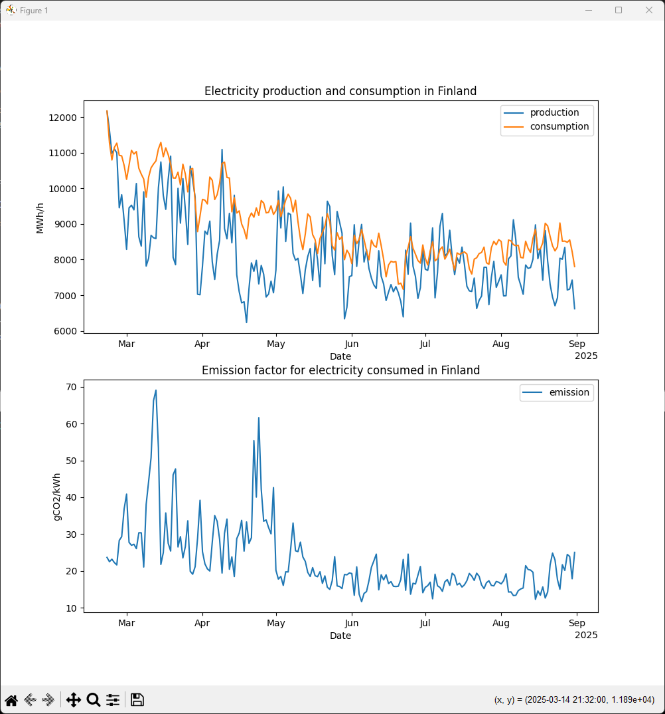

# Sustainable Engineering - Assignment 4

This is an assigment for Tampere University. It is a very simple Python application to view Finnish electricity production, consumption and emission factors for a specified duration. The results are displayed in a chart.

The app uses data from Fingrid via their open data API: https://data.fingrid.fi/.

## Install

- Install Python3 (and pip): https://www.python.org/downloads/
- Clone or download the contents of the repository into your machine
- Install the requirements by running `pip install -r requirements.txt`
- Register into https://data.fingrid.fi/ to receive an API key (required)
- Replace `XXX` in source file `src/api.py` with the API key you received in the previous step
- Launch the app by running `python src/main.py <start> <end>` in the project directory, replace `<start>` and `<end>` with start and end dates using format `YYYY-mm-dd`

## Example

With command `$ python src/main.py 2025-02-21 2025-09-01` you should receive the following output:

